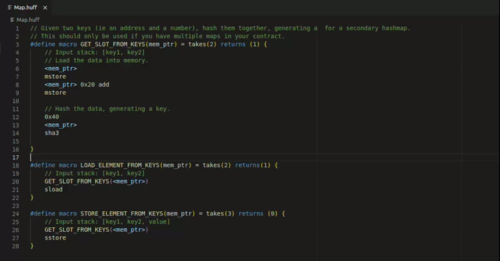

# Huff stack comments - VsCode extension

This VsCode extension allows to generate automatically comments representing the evolution of the stack during the execution of a code written in [Huff](https://github.com/huff-language/huff-rs).
This module was developed for educational purposes only, and it does not use the most efficient way to generate stack comments, but it is interesting for the logic aspects of its execution.

## Features

The following command generate the stack comments into the current Huff file.
```
huff-stack-comments.generate
```
To run it, use `ctrl+shift+p` or `cmd+shift+p` and find it by searching for `Huff: Generate stack comments`.



## Known Issues

You can find the known issues on the [github repository](https://github.com/Yashiru/huff-stack-comments/issues).

## Release Notes

### 0.1.0

TODO for the 0.1.0 first release.

---

## Contribute

### Clone the repository
``` bash
git clone https://github.com/Yashiru/huff-stack-comments.git
```

### Install dependancies
```bash
npm i
```

### Run tests
```bash
npm test
```

### Compile and try the extension in live
Open the cloned repository in Visual Studio Code and press `F5`.

### Following extension guidelines

Ensure that you've read through the extensions guidelines and follow the best practices for creating your extension.

* [Extension Guidelines](https://code.visualstudio.com/api/references/extension-guidelines)